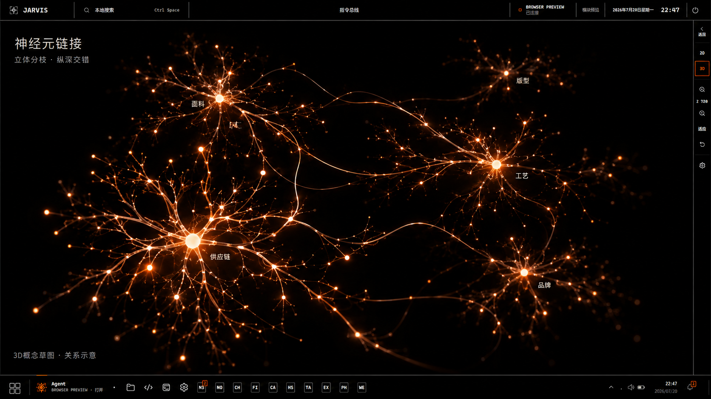

# 神经元 3D：空间纵深修订

2026-09-09。用户选择神经元方向，并要求 3D 具有更丰富的空间纵深和交错关系；旧草图继续作为 2D 模板参照。

草图使用内置 ImageGen 编辑此前的神经元方案。图中标签和关系是示意；实际图谱保留知识库节点与来源关系。

实现入口：探索图谱 → 3D → 图谱视觉设置 → 神经元 · 3D。

- 五类源数据簇处于不同深度；簇内主枝沿旋转球面方向展开，次级分枝继续在局部三维坐标系分叉。
- 连接使用三维曲线，起终点保留实际节点的 XYZ；默认骨架外增加少量短距离真实关系回路。
- 2D 使用原平面布局，3D 单独保存参数。旧的 NEURAL ORB 预设仍可用，应用新预设前自动备份。
- 参数面板前部提供：簇间距、分枝长度、空间厚度、分枝展开、绕行幅度、附加交叉连线、远近明暗。已有节点、连线、信号、Bloom 控件继续生效。

默认参数：簇间距 1.20；分枝长度 1.50；空间厚度 1.00；分枝展开 48%；绕行幅度 0.80；附加交叉连线 30%；远近明暗 70%。9 月 10 日共用枝条材质更新后，连线 Core 宽度为 0.95、发光为 1.8；Halo 半径 1.15、透明度 0.12、发光 2、衰减 2.8。保留之前校准的局部节点发光与 Bloom。收尖、圆润与通透参数见[球体与 3D 共用枝条材质](neuron-filament-notes.md)。

## 生成提示词

Use case: precise-object-edit / UI concept.
Edit target: the supplied Jarvis neural connections concept. Keep the exact black desktop HUD frame, restrained orange/ivory palette, thin edges, tools and typography. Revise ONLY the central neuron network into a genuinely volumetric 3D NEURON exploration with deep interwoven branches. This is a refinement of the chosen neural direction, not a new nebula option.
Replace the five planar radial flowers with five unequal, asymmetric dendritic volumes. Their hubs sit at substantially different depths: a modest larger near lower-left group, a mid-depth upper-left and center-right pair, small far upper-right cluster and medium rear lower-right cluster. Every cluster itself has significant volume: several branches project toward the viewer, several recede, and others curve sideways in different planes. Use oblique camera perspective, strong but tasteful foreshortening, varied node scale with distance, crisp foreground cores and subdued tiny distant nodes. Branches should visibly overlap in projection and pass over/under at separate depth, with readable black gaps. Design a few long slender axons looping forward and then behind neighboring branches, not flat arcs between radial hubs. Add a small number of short source-like cross-branch loops for neural network richness, no all-to-all hairball.
Warm white-hot tiny somas, amber-orange dendrites and isolated hot synapses, fine luminous filaments. Preserve energetic local glow on lines and cores, but no large circular halo, no general fog, no blown-out white mass, no thick fleshy/tubular neuron material. Roughly hundreds of tiny notes implied across the volumes. Half of canvas remains black. Keep graph inside chrome. Exact heading: 神经元链接. Subtitle: 立体分枝 · 纵深交错. A few unobtrusive illustrative hub labels: 面料, 版型, 工艺, 供应链, 品牌. Bottom caption: 3D 概念草图 · 关系示意. Wide 16:9 high fidelity UI sketch, convincingly navigable depth, not an astronomical photo or planar infographic.
