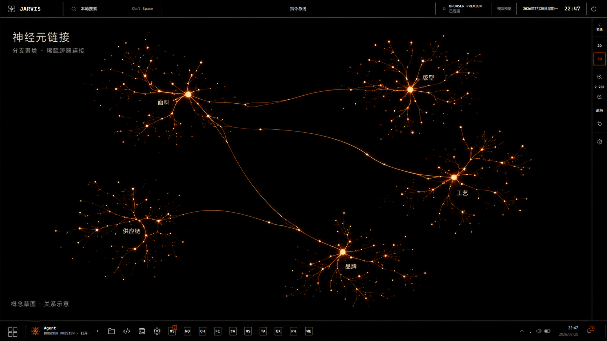
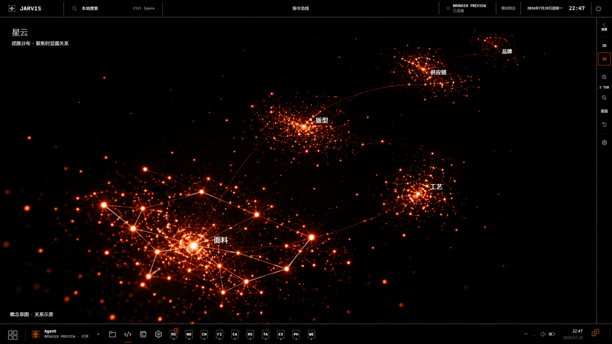

# 3D 图谱概念草图

2026-09-10：新增 [神经元球体](3d-neuron-sphere-concept.png) 与 [神经元大脑](3d-neuron-brain-concept.png) 两张形态草图；[生成记录与提示词](3d-neuron-volume-notes.md)。用户随后选定球体作为退出探索后的待机形态，已实现并启用 2D、3D、待机共用特效的试用模式。大脑仍是未选定的概念。

2026-09-08。用户要求探索“神经元链接”和“星云”两个方向，重点解决节点分布、堆叠、距离和连线方式。下列图片均为概念草图，不是运行截图。服装知识分类仅用于示意。

2026-09-09：用户已选择先实现神经元。原图用于 2D 模板；3D 按[空间纵深修订](3d-neuron-depth-notes.md)实现独立布局和调节项。星云仍是未选定的方向。

## 神经元链接

- 节点沿短分支逐级展开，相关笔记形成多个不等大的知识团簇。
- 团簇之间留出黑色空隙，用少量较长的曲线表达跨簇关系，避免全图交叉连线。
- 近处节点清晰，远处分支更小、更淡；旋转时通过前后错位呈现纵深。
- 适合查看关系路径和知识结构。代价是需要明确的聚类层级，复杂的多对多关系应通过聚焦或展开查看，不能被草图的树形外观误导。

## 星云

- 用粒子的疏密形成不规则团簇，团簇之间的距离、大小和前后位置不均匀。
- 概览以节点为主；聚焦一个团簇后，才显露其中的局部关系和少量跨簇路径。
- 近处粒子较大、亮核清楚，远处变小变淡；保持黑色通道，避免全画面雾光。
- 适合全局浏览与空间探索。代价是概览不会同时展示所有真实关系，需配合清楚的聚焦和展开行为。

## 两个方向共有的约束

- 保留现有黑底、橙色连线、热亮核与局部光晕，不能重新引入整球大光圈。
- 真实笔记与关系仍是底层数据；草图中的简化连接不是新的知识事实。未来若聚合边，需要可展开回真实关系。
- 布局与相机按视图保留；新的共用模式同步 2D、3D 与待机特效，仍可切回各视图独立。最初草图阶段未修改运行代码；后续神经元实现见空间纵深修订记录。
- 可考虑以星云作为全局概览、以神经元分支作为聚焦后的关系表达；这只是组合建议，尚未选定。

## 生成记录

使用内置 Image Gen 工具。第一张输入是当前 3D 探索截图（界面外框及拥挤问题），第二张输入是用户已接受局部光晕的待机截图（发光风格）。两张结果分别独立生成。

神经元方向提示词

Edit the attached JARVIS desktop graph screenshot into a polished exploratory design sketch named 神经元链接. Target dimensions 1920 x 1080, landscape. This is a conceptual redesign of the graph canvas, not implementation and not a literal biological illustration.
Reference roles: first image is the edit target; retain its flat black desktop viewport, thin neutral dividing lines, minimal JARVIS top bar, orange active 3D rail on the far right and restrained taskbar. Its overcrowded white graph is the problem to replace completely. Second image is a supporting lighting reference ONLY: incandescent orange filaments with tiny warm-white node cores and tight local glow; do not copy its spherical shape.
Replace the entire central graph with a spacious three-dimensional neuronal knowledge network, clearly different from a ball, a galaxy, or a generic force-directed hairball. Arrange five unequal branching communities on separated foreground, middle and background layers, joined by only three or four graceful long axon-like bridges. Use a meandering asymmetric composition across the usable viewport, no single central master hub. Every community has a modest luminous soma/hub and several tapered, gently curved dendrite-like paths with smaller note nodes branching at different distances. Let short local links dominate; leave large black corridors between communities and around every bridge. The branches are elegant digitally rendered orange filaments, precise and structural, not fleshy neurons, lightning bolts, roots or thick tubes. Roughly a few hundred tiny notes are implied; do not draw every possible relationship. Near nodes are slightly larger and crisp; rear networks smaller and quieter, enough perspective and parallax cues to imagine orbiting the scene. Keep at least half the viewport visually black, keep all graph content inside the frame. No white blown-out patch, no broad circular aura, no global fog.
Add a small quiet canvas title 神经元链接 with subtitle 分支聚类 · 稀疏跨簇连接. Label only five illustrative fashion-knowledge communities with readable light-neutral Chinese text: 面料, 版型, 工艺, 供应链, 品牌. Attach each label unobtrusively near a hub with breathing room. These labels are conceptual examples, not recovered data. In the bottom-left of the canvas add 概念草图 · 关系示意. Remove real data counts and tiny overlapping node labels from the original canvas. Do not introduce panels, metrics, cards, additional charts or decorative UI. Realistic production-quality desktop visualization concept, precise typography and purposeful spacing. Prioritize distribution, distances, depth and understandable links over raw brightness.

星云方向提示词

Edit the attached JARVIS desktop graph screenshot into a polished exploratory design sketch named 星云. Target dimensions 1920 x 1080, landscape. This is a conceptual 3D knowledge-map redesign; preserve the JARVIS app shell while replacing only its central graph visualization.
Reference roles: first image is the edit target, supplying the flat black desktop viewport, thin neutral lines, restrained JARVIS top bar, far-right 3D rail and taskbar. Its dense, blown-out white graph must be entirely removed. The second image supplies ONLY the accepted illumination language: incandescent orange points, warm-white tiny cores, fine orange connectors and tight local Bloom. Do not copy the sphere.
Make an unmistakably SPATIAL NEBULA / STAR-CLUSTER knowledge-map direction, not a neuron tree, not five radial flowers, not a wireframe ball, and not an astronomical stock photograph. Show five irregular unequal constellations of notes drifting through black space at markedly different depths. Arrange them on a gently tilted, asymmetric S-shaped volume receding from a larger detailed lower-left foreground cloud through the center toward two much smaller distant upper-right groups. Individual particles are the primary medium: hundreds of tiny discrete amber/red-orange stars with a handful of distinct warm-white hubs. Each cluster has a broken, naturally feathered density gradient, not a hard boundary or uniform lattice. Distances between clusters should be generous and unequal; show wide black channels. Render a convincing deep-space oblique camera perspective: foreground nodes modestly larger and crisp, far nodes very tiny and quieter, isolated out-of-focus pinpoints only at depth extremes. This must feel like moving through a navigable 3D volume, not viewing a flat infographic.
Use extremely subtle ember dust confined to the dense local cluster centers, formed primarily by particles. The canvas remains mostly pure black, with NO broad circular glow, NO orange fog filling the screen, NO flat luminous discs, NO opaque gas cloud, NO blown-out central sun, NO planetary bodies, NO orbit rings, and NO blue/purple rainbow nebula. Keep equal perceived point and filament energy to the accepted reference rather than turning everything dim.
Only one foreground or central cluster is currently focused: reveal a sparse, delicate web of 20–35 short neighbor relations among its clearly separated nodes. Outside it, let particles suggest the other communities, with only 3 or 4 extremely restrained gently curved inter-cluster paths visible. No all-to-all links, no every-node-to-central-hub spokes, no crisscross web covering the whole viewport. This selective link visibility is the key interaction idea: constellation overview first, details on focus.
Preserve the thin square black UI frame. A small quiet upper-left title reads 星云, with subtitle 团簇分布 · 聚焦时显露关系. Label only five conceptual fashion knowledge regions near their cloud centers: 面料, 版型, 工艺, 供应链, 品牌. Use readable off-white Chinese labels that float with clear space, not labels on every particle. Bottom-left caption: 概念草图 · 关系示意. Remove original graph labels and real node/relation counts from the canvas. Do not add panels, charts, metrics, badges or feature inventory. Produce a finished, beautiful, realistic desktop visualization concept sketch whose distribution, depth, distance and sparse relations are immediately understandable.

